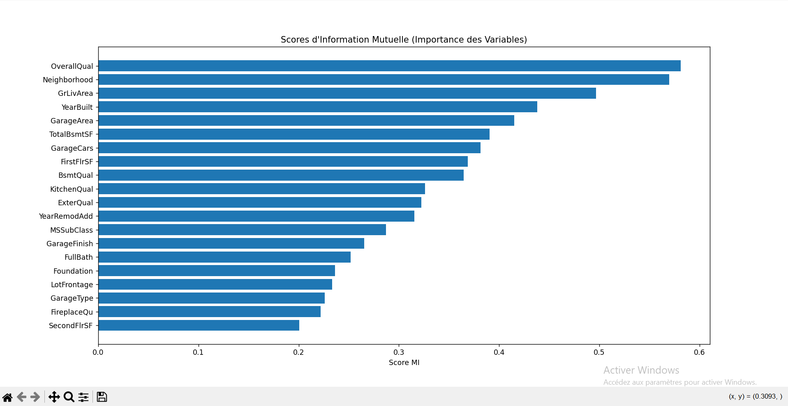

# 🏠 Ames Housing Analysis: Feature Selection Strategy

## 📌 Vue d'ensemble (Overview)
Ce projet vise à optimiser la prédiction des prix immobiliers en se concentrant sur l'étape la plus critique du Machine Learning : **le Feature Engineering**.

Plutôt que d'envoyer toutes les données brutes dans un modèle, j'ai utilisé l'**Information Mutuelle (Mutual Information)** pour identifier mathématiquement les variables qui influencent réellement le prix (`SalePrice`).

## 📊 Résultats Clés (Key Insights)
L'analyse a révélé que la valeur d'une maison n'est pas seulement liée à sa surface. Voici le Top 4 des facteurs déterminants identifiés par mon algorithme :

| Feature | Score MI | Analyse Business |
| :--- | :--- | :--- |
| **YearBuilt** | `0.438` | L'âge du bien est le facteur #1. Le neuf coûte plus cher. |
| **GarageArea** | `0.415` | La capacité de stationnement est cruciale pour ce marché. |
| **TotalBsmtSF**| `0.390` | La surface du sous-sol joue un rôle majeur. |
| **KitchenQual**| `0.326` | **Insight :** La qualité de la cuisine (Variable Catégorielle) impacte fortement le prix, validant l'importance de l'encodage des données (Label Encoding). |

## 🛠️ Stack Technique
* **Data Processing:** Pandas, NumPy
* **Cleaning:** Imputation des valeurs manquantes & Factorisation
* **Machine Learning:** Scikit-Learn (`mutual_info_regression`)
* **Visualization:** Seaborn, Matplotlib

