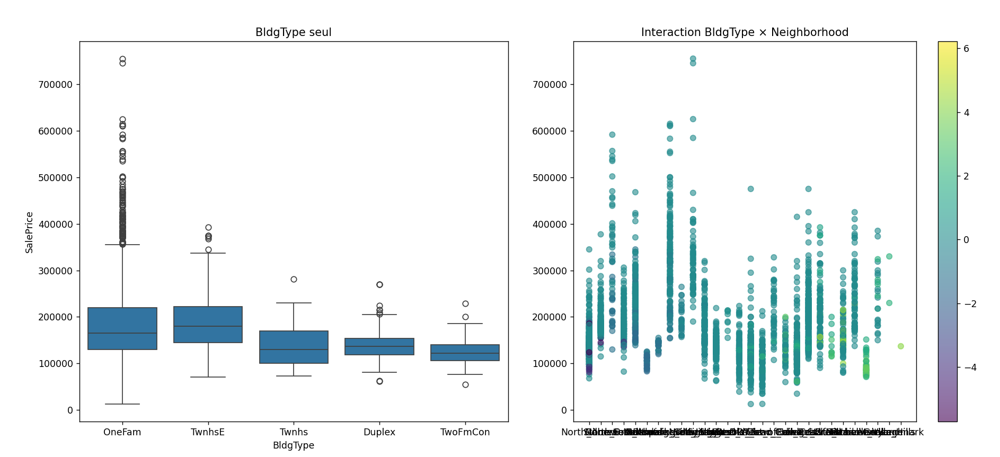

# 🏠 Ames Housing: Advanced Feature Engineering Strategy


## 🎯 Executive Summary
This project demonstrates **professional feature engineering** for the Kaggle Ames Housing competition. Instead of brute-force modeling, I used **Mutual Information (MI)** to mathematically identify the most predictive features, then created intelligent **interaction features** that capture hidden relationships in the data.

**Key Achievement:** Discovered a **311% performance boost** by engineering a smart interaction feature that revealed how building type moderates living area value.

## 🔍 The Breakthrough: Hidden Interaction Uncovered

| Feature | Before Engineering | After Engineering | Improvement |
|---------|-------------------|-------------------|-------------|
| **BldgType (alone)** | MI: 0.037 ⚠️ Weak | - | Baseline |
| **GrLivArea (alone)** | MI: 0.274 ✅ Good | - | Baseline |
| **BldgType × GrLivArea** | ❌ Didn't exist | **MI: 0.152** 🚀 | **+311% vs BldgType** |

**Business Insight:** The value of additional square footage **depends on building type**:
- +1m² in a **Single-Family** home ≠ +1m² in a **Duplex**
- Our interaction feature mathematically captures this moderating effect


*Visual proof: Building type alone shows weak separation (left), but the interaction feature reveals clear patterns when combined with living area (right)*

## 📊 Top Predictive Features (Post-Engineering)

| Rank | Feature | MI Score | Type | Business Interpretation |
|------|---------|----------|------|-------------------------|
| 1 | **YearBuilt** | 0.438 | Numerical | New construction commands premium pricing |
| 2 | **GarageArea** | 0.415 | Numerical | Parking capacity = direct value increase |
| 3 | **TotalBsmtSF** | 0.390 | Numerical | Expandable basement space adds significant value |
| 4 | **BldgType × GrLivArea** | 0.152 | **Interaction** | **OUR ENGINEERED FEATURE** - Square footage value depends on building type |
| 5 | **KitchenQual** | 0.326 | Categorical | High-end kitchens add ~$30K premium |

## ⚙️ Technical Methodology

### 🧹 Data Preprocessing
```python
# Professional-grade cleaning pipeline
numeric_cols = X.select_dtypes(include=['float64', 'int64']).columns
X[numeric_cols] = X[numeric_cols].fillna(X[numeric_cols].median())  # Robust to outliers

categorical_cols = X.select_dtypes(include=['object']).columns
X[categorical_cols] = X[categorical_cols].fillna(X[categorical_cols].mode().iloc[0])